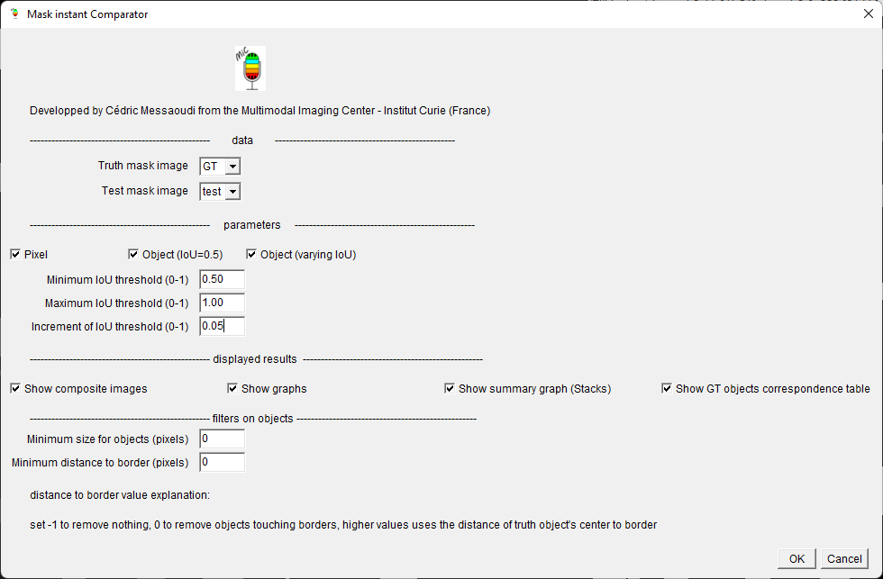

# Mask instant Comparator (MiC) 

## About

MiC is an ImageJ plugin to compare segmentation masks. 
- It computes the number of **true positive (TP)**, **false positives (FP)** and **false negatives (FN)**
	+ at pixel level 
	+ at object level with an overlap (or intersection over union  - IoU) of 0.5
		+ possibility of varying IoU 
- It computes metrics
	+ **Precision** defined as $\frac{TP}{TP + FP}$
	+ **Recall** (or sensitivity) defined as $\frac{TP}{TP + FN}$
	+ **Jaccard index** (or global perecision) defined as $\frac{TP}{TP + FP + FN}$
	+ **F1-measure** (or Sorensen Dice Coefficient - DSC) defined as $\frac{2TP}{2TP + FP + FN}$
- It displays the **superposition of the two masks** with the ground truth in green and the mask to evaluate in red for pixel level, for Object level the truth is in green, the mask to evaluate in red, TP are thus yellow, FP blue, FN dark green. 
- It displays the **plots** corresponding to metrics as function of IoU
- All computed values are stored in **result tables** that can be exported in excel or csv format
- possibility to work on **stacks**. It works only in **2D** for now, each slice will be compared to corresponding slice. If varying IoU, an additional plot is displayed with metrics corresponding to the sum of TPs, FNs and FPs on all images.
- the plugin is **macro recordable**

## Install

download the jar file and copy into plugin Folder of ImageJ
or use the updater in Fiji:

menu >Help>Update...

click the button "Manage update sites"

select MiC mask comparator

if it is not available directly you can add it (button add update site) with the folowing URL https://sites.imagej.net/MiC-mask-comparator/

## Usage

run >Plugin>MiC>Mask instant Comparator

### Parameters

Selection of images to work with 
+ Truth mask image
+ Test mask image

Selection of level for metrics computations
+ Pixel
+ Object (IoU=0.5)
+ Object (Varying IoU)

Selection of parameter for varying threshold for the object level with varying IoU
+ Minimum IoU threshold (0-1)
+ Maximum IoU threshold (0-1)
+ Increment of IoU threshold (0-1)

Selection of outputs
+ Show composite images
+ Show graphs 
+ Show summary graph (Stacks)
+ Show GT objects correspondence table

Selection of filters on objects to remove objects touching border of image or small objects that might be due to noise

+ Minimum size for objects (pixels)
+ Minimum distance to border (pixels)
	* -1 to remove nothing
	* 0 to remove object touching borders
	* higher values to define a minimal distance of object's center to border

### Outputs description

Once the program ends the computation, several ouputs are displayed.

Depending on the choice of parameters, the outputs consist of 
+ one stack of superimposed masks (if "show composite images" is checked)
+ one plot if the varying IoU is selected and "show graphs" is checked. It displays the 4 metrics score on ordinate and IoU on abscissa 
	+ if working on stack this plot is replaced by
		+ a stack of plot with one plot for each slice, corresponding to metrics for corresponding slice
		+ a plot with metrics computed by summing objects from all slices (if "show summary graph" is checked)
+ several result tables
	- one containing counts of TP, FP, FN, metrics at pixel / object level
	- one containing counts with varying IoU
	- one containing information about correspondence found with notably the IoU for each object (if "show GT correspondence table" is checked)

#### image: display of masks GT_VS_mask

This stack of images is displayed when the option "Show composite images" is selected. The first slice is the pixel level superposition if the option "Pixel" is selected. The second is the Object level (IoU = 0.5) superposition if the option "Object (IoU=0.5)" is selected. The next slices correspond to object level  with varying IoU thresholds, when the corresponding option is selected. The IoU thresholds used are displayed in the slice label.

The mask to test is superimposed to the ground truth with a color code
+ for pixel level
	*  **green** for GT (FN)
	* **red** for mask (FP)
	* **yellow** where the two masks overlaps (TP)

 

+ for object level (the IoU threshold is displayed in the slice label)	
	-  **yellow** (TP): these are objects common to both masks (GT, test) and validated by the given IoU threshold. 
	-  **green** (TP): these are true positives with objects that are underestimated (smaller in the test mask).
	- **red** (TP): these are true positives with objects that are overestimated (larger in the test mask). 
	- **dark green** (FN): these are false negatives, objects in the GT mask that don't match any object in test mask.
	- **blue** (FP): These are false positives, test mask objects that do not match any object in GT mask.
	- **cyan** (FP and FN or FP): two possibilities:
		- these are objects common to both masks (GT, test ) but not validated by the given IoU threshold. 
		- These are false positives corresponding to the division of an object in the GT mask into several objects in the test mask. One of the objects in the test mask will be yellow or cyan (depending on validation by the given IoU threshold), the others will necessarily be cyan.
	- **orange** (FN): These are false negatives corresponding to the merging of objects in the GT mask into a single object in the test mask, one of whose objects is validated by the given IoU threshold. One of the objects in the GT mask will be yellow, while the others will be orange.
	- **royal blue** (FP): These are false positives that correspond to the merging of objects in the GT mask into a single object in the test mask, one of whose objects has a match but is not validated by the given IoU threshold. One of the objects in the GT mask will be cyan, the others will be royal blue (often also associated with dark green).
	-  **black**: pixels belonging to no object.
	-   **grey**: these are objects eliminated with respect of distance to border parameter 
	
___Warning!___  
Take a special care when using the option "Object (varying IoU)", the number of image can be quite high depending on the number of slices and the number of thresholds tested (defined using minimum, maximum and increment). As it is a composite image 4 images are created for each test (green for GT, red for TP in mask, blue for FN in mask and gray for non valid objects), the memory usage is high. 

#### result window 1: Mask comparison results

This result table displays for each slice 
+ the information of images and slice compared
+ the parameters of distance to border and minimum size of objects
+ the number of objects in each compared image
+ for Pixel level
	* the number of pixels that are considered as TP, FP and FN
	* the 4 metrics
+ for object level (IoU = 0.5)
	* the number of objects that are considered as TP, FP and FN
	* the 4 metrics

#### result window 2: Mask comparison with IoU thresholds

This result table displays only when using varying IoU threshold option. It shows for each slice and each threshold tested a line containing:
+ the information of images and slice compared
+ the number of objects in each compared images
+ the IoU threshold used
+ the number of objects that are considered as TP, FP and FN
+ the 4 metrics

#### result window 3: Objects correspondences

This result table displays when the option "show GT objects correspondence table" is selected. It is associated with the ROIManager. It shows for each slice and for each object in ground truth mask a line containing:
+ the information of image and slice (the slice number is concatenated to image name after an underscore)
+ the object index in the ROIManager
+ the object's center coordinates
+ the distance of this object's center to border
+ a flag to tell is the distance of object to border makes it valid for analysis (1 = OK, 0 = removed from analysis)
+ the corresponding object index found
+ the IoU value between these two objects (if several objects overlap the GT object only the one with higher IoU is kept)

The ROI manager is also displayed with all ROIs from GT.

#### plot window 1: plots GT_VS_mask

This image stack displays when using the option "Object (varying IoU)" and the option "show graphs (varying IoU)". It shows, for each slice, the plot of the 4 metrics with the varying IoU thresholds.

#### plot window 2: plots summing all objects from stack

This plot window displays when using the option "Object (varying IoU)" and the option "show summary graph (varying IoU)". It computes the sums of objects in all slices in each category (TP, FP, FN) and then calculates the 4 metrics with these sums. The plot shows the 4 metrics with the varying IoU thresholds.  
Using the List button, the values of the metrics can be recovered directly in a table that can be exported.

## Licensing

 MiC plugin is licensed under the MIT License
